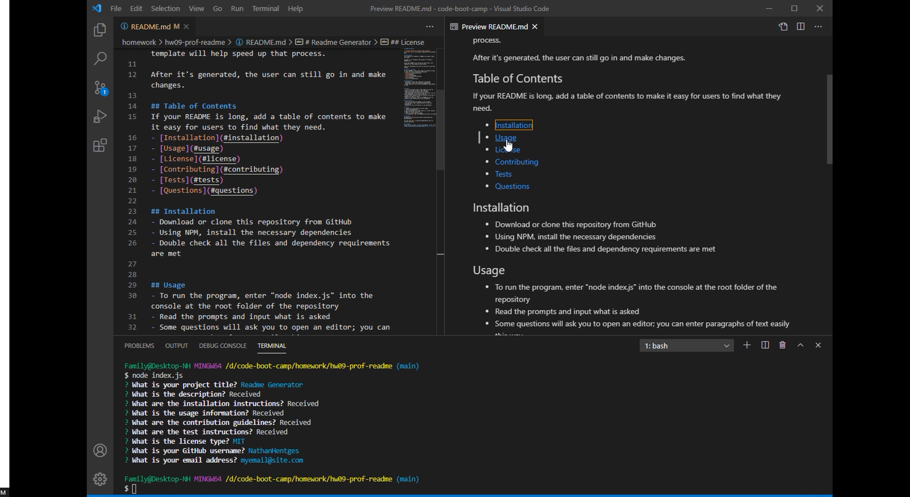

# Readme Generator

## Description
This program will generate a README file based on data you input.

Its goal is to streamline the process of creating a README file. 

Since many README files follow the same format, this template will help speed up that process.

After it's generated, the user can still go in and make changes.

A demonstration of the program running can be found here:
[assets/demonstration-video.mp4](assets/demonstration-video.mp4)

The resulting file can be found here [assets/generated-README.md](assets/generated-README.md).

Below is a screenshot from the video; the final result and commandline history.

## Table of Contents
- [Installation](#installation)
- [Usage](#usage)
- [Contributing](#contributing)
- [Tests](#tests)
- [Questions](#questions)

## Installation
- Download or clone this repository from GitHub
- Using NPM, install the necessary dependencies
- Double check all the files and dependency requirements are met

## Usage
- To run the program, enter "node index.js" into the console at the root folder of the repository
- Read the prompts and input what is asked
- Some questions will ask you to open an editor; you can enter paragraphs of text easily this way
- Select which license to use by using the arrow keys to navigate and enter to select
- When it's finished, a new file "README.md" will be created and be filled with all the information

## Contributing
- Feel free to make any changes to this program
- You may make a pull request/contact me with your contribution
- Adoption of your contribution is not guaranteed

## Tests
1. Inspect all files within the root folder
2. Check npm dependencies
3. Run the program with "node index.js" in your console, located at the root directory
4. Enter in simple text as a test
5. On completion, open the README.md and check its preview

## Questions
My GitHub is [NathanHentges](http://www.github.com/NathanHentges)

You can also [email me](mailto:myemail@site.com) for further questions.

## Notes
F
